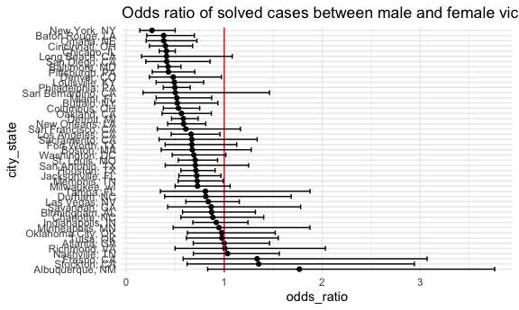

p8105_hw6_yl5227
================
Jennifer Li
2023-12-02

# Problem 1

data cleaning

``` r
homi_df = 
  read_csv("data/homicide-data.csv") |> 
  mutate(
    city_state = str_c(city, ", ", state),
    solved = !disposition %in% c("Closed without arrest","Open/No arrest"),
    victim_age = as.numeric(victim_age)
  ) |> 
  filter(
    !city_state %in% c("Dallas, TX", "Phoenix, AZ", "Kansas City, MO", "Tulsa, AL"),
    victim_race %in% c("Black", "White")
  ) |> 
  select(uid,city_state,solved,victim_race, victim_age, victim_sex) |> 
  na.omit()
```

    ## Rows: 52179 Columns: 12
    ## ── Column specification ────────────────────────────────────────────────────────
    ## Delimiter: ","
    ## chr (9): uid, victim_last, victim_first, victim_race, victim_age, victim_sex...
    ## dbl (3): reported_date, lat, lon
    ## 
    ## ℹ Use `spec()` to retrieve the full column specification for this data.
    ## ℹ Specify the column types or set `show_col_types = FALSE` to quiet this message.

Do the logistic regression on `Baltimore, MD`.

``` r
logi_fit = 
  homi_df |> 
  filter(city_state == "Baltimore, MD") |> 
  glm(solved~ victim_race + victim_age + victim_sex, data = _, family = "binomial")

logi_fit |> 
  broom::tidy() |> 
  filter(term == "victim_sexMale") |> 
  mutate(
    odds_ratio = exp(estimate),
    conf_low = exp(estimate  - 1.96 * std.error),
    conf_high = exp(estimate + 1.96 * std.error)
  )  |> 
  select(term, odds_ratio, conf_low, conf_high)
```

    ## # A tibble: 1 × 4
    ##   term           odds_ratio conf_low conf_high
    ##   <chr>               <dbl>    <dbl>     <dbl>
    ## 1 victim_sexMale      0.426    0.325     0.558

Iterate over other cities with logistic regression.

``` r
logi_fit =
  homi_df |> 
  nest(data = c(uid, solved, victim_age, victim_race, victim_sex)) |> 
  mutate(
    model = map(.x = data, ~glm(solved ~ victim_race + victim_age + victim_sex, data = .x, family = "binomial")),
    estimate = map(.x  = model, ~filter(broom::tidy(.x), term == "victim_sexMale"))
  ) |> 
  unnest(estimate) |> 
  mutate(
    odds_ratio = exp(estimate),
    conf_low = exp(estimate  - 1.96 * std.error),
    conf_high = exp(estimate + 1.96 * std.error)
  )  |> 
  select(city_state, odds_ratio, conf_low, conf_high)

logi_fit
```

    ## # A tibble: 47 × 4
    ##    city_state      odds_ratio conf_low conf_high
    ##    <chr>                <dbl>    <dbl>     <dbl>
    ##  1 Albuquerque, NM      1.77     0.831     3.76 
    ##  2 Atlanta, GA          1.00     0.684     1.46 
    ##  3 Baltimore, MD        0.426    0.325     0.558
    ##  4 Baton Rouge, LA      0.381    0.209     0.695
    ##  5 Birmingham, AL       0.870    0.574     1.32 
    ##  6 Boston, MA           0.674    0.356     1.28 
    ##  7 Buffalo, NY          0.521    0.290     0.935
    ##  8 Charlotte, NC        0.884    0.557     1.40 
    ##  9 Chicago, IL          0.410    0.336     0.501
    ## 10 Cincinnati, OH       0.400    0.236     0.677
    ## # ℹ 37 more rows

Finally, plot the odds ratio between cities.

``` r
logi_fit |> 
  mutate(
    city_state = fct_reorder(city_state, -odds_ratio)
  ) |> 
  ggplot(aes(x = odds_ratio, y = city_state)) +
  geom_point() +
  geom_vline(aes(xintercept = 1), color = "red") +
  geom_errorbar(aes(xmin = conf_low, xmax = conf_high)) +
  labs(title = "Odds ratio of solved cases between male and female victims")
```



Thus, in most cities, after adjusting for race and age, cases with male
victims have more odds to be unsolved.

# Problem 2

Use code provided to download `Central Park` weather data.

``` r
weather_df = 
  rnoaa::meteo_pull_monitors(
    c("USW00094728"),
    var = c("PRCP", "TMIN", "TMAX"), 
    date_min = "2022-01-01",
    date_max = "2022-12-31") |>
  mutate(
    name = recode(id, USW00094728 = "CentralPark_NY"),
    tmin = tmin / 10,
    tmax = tmax / 10) |>
  select(name, id, everything())
```

    ## using cached file: /Users/Jennifer/Library/Caches/org.R-project.R/R/rnoaa/noaa_ghcnd/USW00094728.dly

    ## date created (size, mb): 2023-10-02 20:53:50.165725 (8.525)

    ## file min/max dates: 1869-01-01 / 2023-09-30

# Problem 3

In the code chunk below, I remove rows that contain missing values and
convert `babysex`, `frace`, `mrace` and `malform` to categorical factors
with corresponding values.

``` r
race_ls = c("white","black", "asian", "puerto rican", "other", "unknown")
birth_df = 
  read_csv("data/birthweight.csv") |> 
  na.omit() |> 
  mutate(
    babysex = factor(babysex, levels = 1:2, labels = c("male","female")),
    frace = factor(frace, levels = c(1,2,3,4,8,9),labels = c("white","black", "asian", "puerto rican", "other", "unknown")),
    mrace = factor(mrace, levels = c(1,2,3,4,8),labels = c("white","black", "asian", "puerto rican", "other")),
    malform = factor(malform, levels = 0:1,labels = c("absent","present"))
  ) |> 
  select(bwt, everything())
```

    ## Rows: 4342 Columns: 20
    ## ── Column specification ────────────────────────────────────────────────────────
    ## Delimiter: ","
    ## dbl (20): babysex, bhead, blength, bwt, delwt, fincome, frace, gaweeks, malf...
    ## 
    ## ℹ Use `spec()` to retrieve the full column specification for this data.
    ## ℹ Specify the column types or set `show_col_types = FALSE` to quiet this message.
